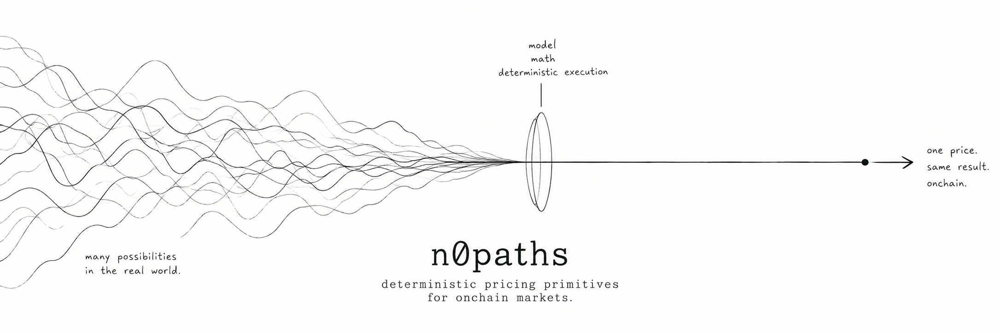

<p align="center">
  
</p>

<p align="center">
  <a href="https://n0paths.xyz/">Website</a>
  &nbsp;·&nbsp;
  <a href="https://x.com/n0paths">X</a>
  &nbsp;·&nbsp;
  <a href="https://etherscan.io/address/0x72D8a762F2b1C317b85a437EB826aBeD79EDF5Dc">Etherscan</a>
  &nbsp;·&nbsp;
  <a href="https://n0paths.xyz/method">Method</a>
  &nbsp;·&nbsp;
  <a href="https://n0paths.xyz/code">Code</a>
  &nbsp;·&nbsp;
  <a href="https://github.com/n0paths/benchmarks">Benchmarks</a>
  &nbsp;·&nbsp;
  <a href="https://github.com/n0paths/engine/actions">CI</a>
  &nbsp;·&nbsp;
  <a href="./LICENSE">MIT</a>
</p>

<p align="center">
  
</p>

# n0paths engine

Deterministic pricing primitives for onchain markets.

[](https://github.com/n0paths/engine/actions/workflows/test.yml)

`n0paths/engine` is an experimental pricing engine for deterministic derivatives valuation.

The first implemented instrument is a discretely monitored arithmetic Asian call under risk-neutral geometric Brownian motion.

```text
market state
     │
     ▼
GBM moment equations
     │
     ▼
exact M₁ and M₂
     │
     ▼
lognormal moment fit
     │
     ▼
deterministic payoff approximation
     │
     ▼
discounted price
```

Same inputs → same outputs.

---

## Model

Under the risk-neutral measure, the underlying follows geometric Brownian motion:

```text
dSₜ = (r - q)Sₜ dt + σSₜ dWₜ
```

where:

- `Sₜ` is the underlying price,
- `r` is the continuously compounded risk-free rate,
- `q` is the continuous dividend or convenience yield,
- `σ` is volatility,
- `Wₜ` is a standard Brownian motion.

The current model assumes constant `r`, `q`, and `σ` over the life of the option.

---

## Arithmetic Asian call

For `n` equally spaced future observations:

```text
tᵢ = iT / n,    i = 1, ..., n
```

The observation schedule excludes `t = 0` and includes `T`.

The arithmetic average is:

```text
A = (1/n) Σ S(tᵢ)
```

The call payoff at expiry is:

```text
payoff = max(A - K, 0)
```

where `K` is the strike.

---

## First moment

Under risk-neutral GBM:

```text
E[S(tᵢ)] = S₀ · exp((r - q)tᵢ)
```

Therefore:

```text
M₁ = E[A]

   = (S₀/n) Σ exp((r - q)tᵢ)
```

`M₁` is the exact first moment of the discrete arithmetic average under the stated GBM assumptions.

---

## Second moment

For two monitoring dates `tᵢ` and `tⱼ`:

```text
E[S(tᵢ)S(tⱼ)]
    = S₀² · exp(
        (r - q)(tᵢ + tⱼ)
        + σ² min(tᵢ, tⱼ)
      )
```

Therefore:

```text
M₂ = E[A²]

   = (S₀²/n²) Σᵢ Σⱼ exp(
       (r - q)(tᵢ + tⱼ)
       + σ² min(tᵢ, tⱼ)
     )
```

`M₂` is the exact second moment under the same discrete GBM assumptions.

The current implementation evaluates the double sum in `O(n²)` time.

---

## Lognormal moment matching

The arithmetic average of lognormal variables is not generally lognormal.

The engine therefore approximates `A` with a lognormal random variable whose first two moments match `M₁` and `M₂`.

```text
ln(A) ~ Normal(μₐ, σₐ²)
```

Matching the moments gives:

```text
σₐ² = ln(M₂ / M₁²)
```

and:

```text
μₐ = ln(M₁) - ½σₐ²
```

The approximation boundary is explicit:

```text
M₁, M₂              analytical under the stated model
lognormal fit        approximation
```

The deterministic nature of the engine does not make the distributional approximation exact.

---

## Pricing

Define:

```text
d₂ = (μₐ - ln(K)) / σₐ

d₁ = d₂ + σₐ
```

Using the fitted distribution, the expected payoff is approximated by:

```text
E[max(A - K, 0)]
    ≈ M₁ Φ(d₁) - K Φ(d₂)
```

where `Φ` is the standard normal cumulative distribution function.

The time-zero value is:

```text
V₀ = exp(-rT) · [M₁ Φ(d₁) - K Φ(d₂)]
```

For a zero-variance distribution:

```text
V₀ = exp(-rT) · max(M₁ - K, 0)
```

This branch handles the deterministic limit directly.

---

## Architecture

```text
src/
├── N0PathsEngine.sol
├── interfaces/
│   └── IPricingEngine.sol
└── libraries/
    ├── AsianMoments.sol
    ├── AsianPricing.sol
    ├── FixedPointMath.sol
    ├── NormalDistribution.sol
    └── TranscendentalMath.sol
```

The pricing pipeline is separated into numerical components:

```text
AsianMoments
     │
     ▼
   M₁, M₂
     │
     ▼
AsianPricing
     │
     ├── lognormal fit
     ├── d₁ / d₂
     ├── normal CDF
     └── discounting
     │
     ▼
N0PathsEngine
```

`N0PathsEngine.sol` exposes the pricing interface.

The libraries contain the underlying numerical routines.

---

## Units

The Solidity implementation uses 18-decimal fixed-point arithmetic.

```text
1.0       = 1e18
100 USD   = 100e18
60% vol   = 0.60e18
4% rate   = 0.04e18
1 year    = 1e18
```

Example:

```solidity
uint256 spot = 100e18;
uint256 strike = 100e18;

uint256 volatility = 0.60e18;

int256 riskFreeRate = 0.04e18;
int256 dividendYield = 0;

uint256 timeToExpiry = 1e18;
uint256 observations = 30;
```

Rates and yields are signed.

Spot, strike, volatility, time to expiry, and observation count use unsigned values.

---

## Interface

The primary pricing entry point is:

```solidity
priceAsianCall(
    MarketState calldata market,
    AsianOption calldata option
)
```

Market state:

```solidity
struct MarketState {
    uint256 spot;
    uint256 volatility;
    int256 riskFreeRate;
    int256 dividendYield;
}
```

Option definition:

```solidity
struct AsianOption {
    uint256 strike;
    uint256 timeToExpiry;
    uint256 observations;
}
```

The pricing result contains the discounted price together with intermediate distribution information used by the engine.

Conceptually:

```text
MarketState
     +
AsianOption
     │
     ▼
N0PathsEngine
     │
     ▼
PriceResult
```

---

## Greeks

The engine exposes numerical Greeks for the arithmetic Asian call.

The current interface computes:

```text
Δ  Delta
V  Vega
```

Delta is estimated using a central spot bump.

Vega is estimated using a central volatility bump when possible and a forward difference near zero volatility.

Conceptually:

```text
             price(S + ΔS)
                   │
price(S) ──────────┼──→ Delta
                   │
             price(S - ΔS)
```

and:

```text
             price(σ + Δσ)
                   │
price(σ) ──────────┼──→ Vega
                   │
             price(σ - Δσ)
```

The Greeks inherit the pricing approximation and introduce finite-difference numerical error of their own.

---

## Determinism

The Solidity pricing path does not use random sampling.

For fixed:

```text
spot
strike
volatility
risk-free rate
dividend yield
time to expiry
observation count
```

the same implementation produces the same output.

```text
same inputs
     │
     ▼
same execution
     │
     ▼
same output
```

This removes sampling variance from the pricing computation.

It does not remove:

```text
model error
approximation error
fixed-point error
implementation error
```

In particular:

```text
0 sampling error ≠ 0 pricing error
```

---

## Numerical methods

The engine implements the numerical primitives required by the model directly in Solidity.

These include:

```text
fixed-point multiplication
fixed-point division
exp(x)
ln(x)
sqrt(x)
normal PDF
normal CDF
```

The implementation uses deterministic WAD arithmetic rather than floating-point arithmetic.

The numerical pipeline therefore has several distinct error sources:

```text
model assumptions
      │
      ▼
distribution approximation
      │
      ▼
transcendental approximations
      │
      ▼
fixed-point rounding
      │
      ▼
final price
```

Additional details are documented in:

```text
docs/METHOD.md
docs/NUMERICS.md
```

---

## Reference implementation

A TypeScript reference implementation lives under:

```text
reference/
```

Relevant files include:

```text
reference/pricing.ts
reference/vectors.json
scripts/generate-vectors.ts
```

The reference implementation uses floating-point arithmetic to represent the same mathematical pricing method independently from the Solidity numerical implementation.

It is intended for development and validation.

It is not an oracle and should not be interpreted as an external source of market truth.

---

## Reference vectors

Reference scenarios can be generated with:

```bash
npm run vectors
```

The generator evaluates predefined scenarios and writes machine-readable outputs.

Reference vectors are useful for comparing:

```text
TypeScript reference
        ↕
Solidity implementation
```

Generated values should be treated as reproducible test data, not manually selected target prices.

---

## Benchmarks

Experimental validation is maintained separately in:

```text
n0paths/benchmarks
```

The benchmark repository compares two independent computational paths:

```text
deterministic path

GBM assumptions
      │
      ▼
exact M₁ and M₂
      │
      ▼
lognormal fit
      │
      ▼
deterministic price


simulation path

GBM assumptions
      │
      ▼
exact GBM transitions
      │
      ▼
simulated arithmetic averages
      │
      ▼
discounted payoffs
      │
      ▼
Monte Carlo estimate
```

The separation is intentional:

```text
engine       → implementation

benchmarks   → experiments / validation
```

Monte Carlo estimates should always be interpreted together with their sampling uncertainty.

---

## Testing

The Solidity project uses Foundry.

Build:

```bash
forge build
```

Run tests:

```bash
forge test
```

Verbose tests:

```bash
forge test -vvv
```

CI fuzz testing:

```bash
forge test --fuzz-runs 10000
```

The test suite is designed around properties including:

```text
deterministic repeatability
moment calculations
pricing monotonicity
zero-volatility behavior
fixed-point numerical primitives
reference-vector comparisons
```

GitHub Actions runs Solidity and TypeScript checks on pushes and pull requests.

---

## CI

The repository includes:

```text
.github/workflows/test.yml
```

The workflow checks:

```text
Solidity
├── formatting
├── build
├── tests
└── fuzz tests

TypeScript reference
├── type checking
├── reference execution
└── vector generation
```

A green workflow means the configured checks completed successfully for that revision.

It is not an audit or proof of economic correctness.

---

## Complexity

For `n` observation dates, the current moment implementation requires:

```text
first moment     O(n)

second moment    O(n²)
```

The second moment dominates the arithmetic Asian pricing path as `n` increases.

The deterministic method therefore removes simulation path count from the pricing computation, but it is not constant-cost with respect to the observation count.

---

## Approximation boundary

The engine is not an exact closed-form solution for an arithmetic Asian option.

The current method can be summarized as:

```text
GBM first moment                 analytical
GBM second moment                analytical

arithmetic-average
distribution                    approximated

lognormal moment fit             approximated

normal CDF                       numerically approximated

Solidity arithmetic              fixed-point

Greeks                           finite differences
```

The deterministic property concerns execution:

```text
same inputs → same outputs
```

It does not imply:

```text
model assumptions → exact market price
```

---

## What the engine does not claim

The project does not currently claim:

```text
exact arithmetic Asian pricing
production readiness
audit completion
mainnet deployment
oracle integration
universal market calibration
zero numerical error
```

The current implementation is research software.

---

## Current limitations

The current model and implementation assume:

- risk-neutral geometric Brownian motion,
- constant volatility,
- constant risk-free rate,
- constant dividend or convenience yield,
- equally spaced future observations,
- no observation at `t = 0`,
- lognormal moment matching for the arithmetic average.

Implementation limitations include:

- `O(n²)` second-moment evaluation,
- fixed-point approximation error,
- numerical `exp` and `ln`,
- numerical normal CDF,
- finite-difference Greeks,
- finite numerical domains for practical Solidity execution.

The supported domain should therefore be validated explicitly before any production use.

---

## Repository layout

```text
engine/
├── .github/
│   └── workflows/
│       └── test.yml
│
├── docs/
│   ├── METHOD.md
│   └── NUMERICS.md
│
├── reference/
│   ├── pricing.ts
│   └── vectors.json
│
├── scripts/
│   ├── benchmark.ts
│   └── generate-vectors.ts
│
├── src/
│   ├── interfaces/
│   │   └── IPricingEngine.sol
│   │
│   ├── libraries/
│   │   ├── AsianMoments.sol
│   │   ├── AsianPricing.sol
│   │   ├── FixedPointMath.sol
│   │   ├── NormalDistribution.sol
│   │   └── TranscendentalMath.sol
│   │
│   └── N0PathsEngine.sol
│
├── test/
│
├── foundry.toml
├── package.json
├── tsconfig.json
├── LICENSE
└── README.md
```

---

## Research direction

The current arithmetic Asian implementation is the first pricing primitive.

The broader research direction is deterministic evaluation of derivative payoffs using compact representations that are suitable for constrained execution environments.

The immediate focus is:

```text
correctness
    ↓
numerical validation
    ↓
reproducibility
    ↓
benchmarking
    ↓
additional pricing primitives
```

New models and instruments should be added only with explicit assumptions, numerical methodology, validation, and approximation boundaries.

---

## Status

**Experimental research software.**

The current objective is to make the pricing method:

```text
explicit
deterministic
reproducible
testable
```

before expanding the supported model and instrument surface.

No audit or production deployment is claimed.

---

## License

MIT
